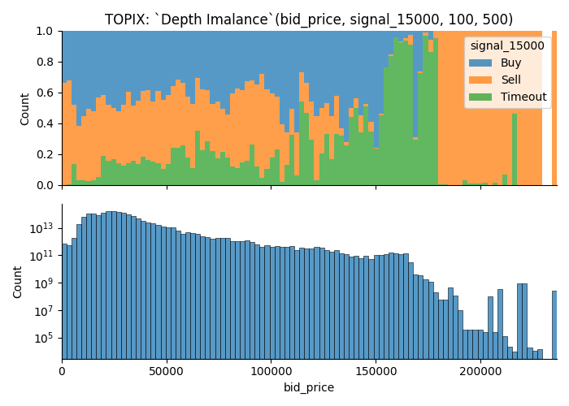
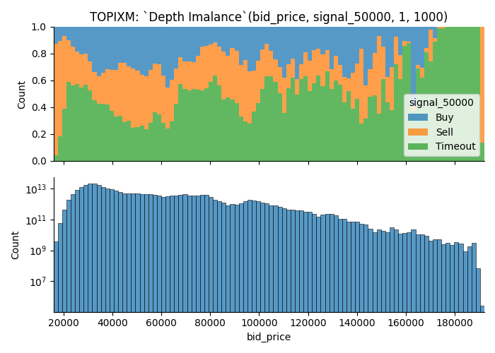
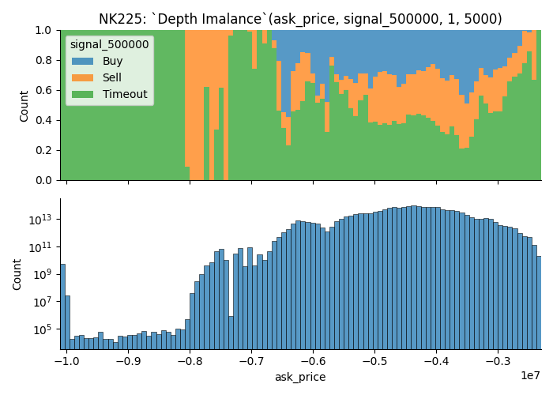
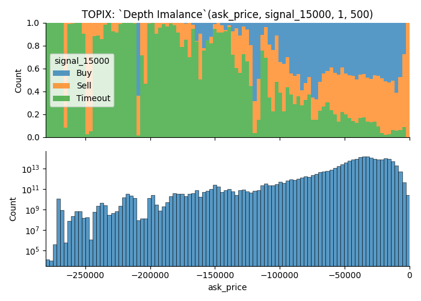
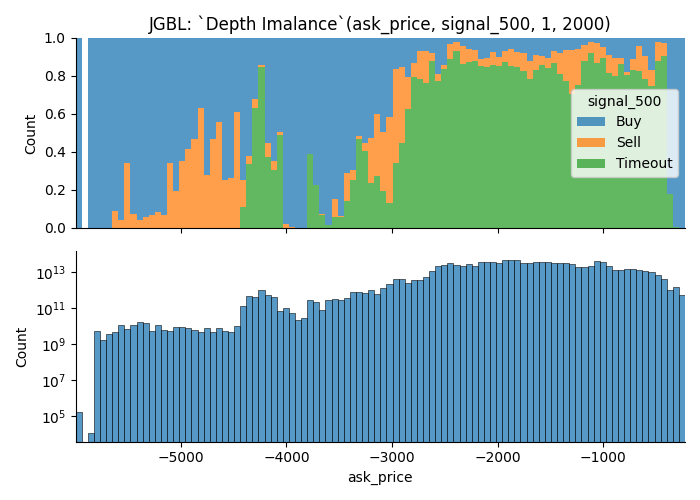
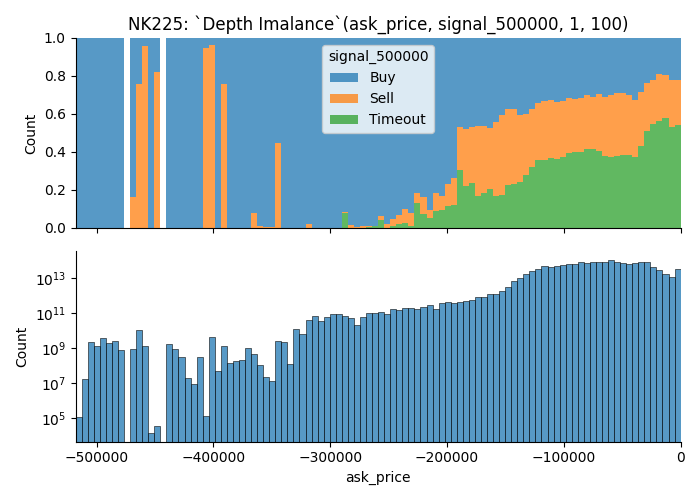
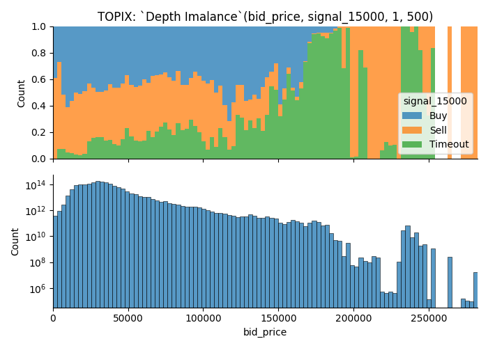
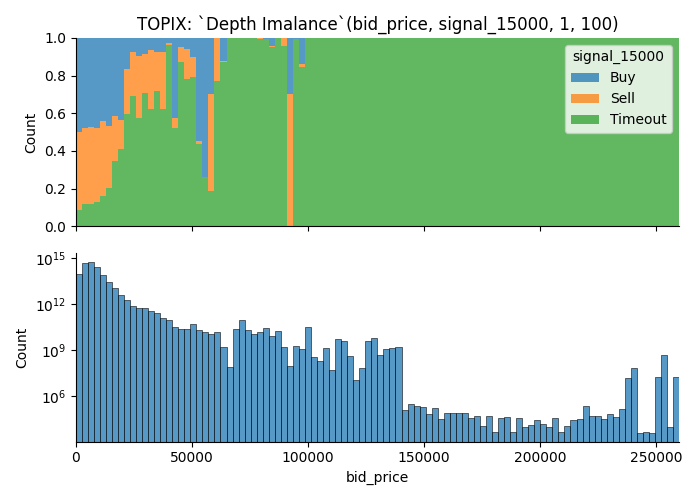
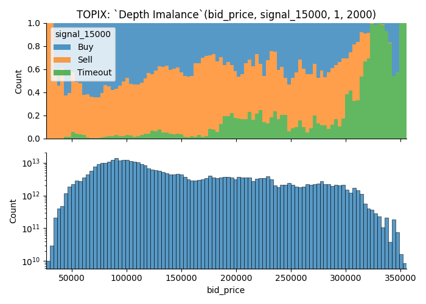

# Research Question 3: Depth Imbalance
- [Research Question 3: Depth Imbalance](#research-question-3-depth-imbalance)
  - [Summary](#summary)
  - [Overview of Data](#overview-of-data)
    - [Market Depth](#market-depth)
    - [Depth Imbalance](#depth-imbalance)
    - [Aggregating Depth Imbalance](#aggregating-depth-imbalance)
  - [Results](#results)
    - [More trading opportunities when the depth imbalance is closer to 0](#more-trading-opportunities-when-the-depth-imbalance-is-closer-to-0)
    - [More trading opportunities when the depth imbalance is further from 0](#more-trading-opportunities-when-the-depth-imbalance-is-further-from-0)
    - [Trading opportunities on less-commonly observed values](#trading-opportunities-on-less-commonly-observed-values)
    - [Examples how removal of illiquid moments affect the visualization](#examples-how-removal-of-illiquid-moments-affect-the-visualization)
  - [Future Direction](#future-direction)

## Summary
- Market tends to offer more trading opportunities when order book is more liquid; However, there are some details to it
- Market depth is *what the average execution price of FOK market order would be at given tick of an orderbook*
- Market liquidity is measured in difference between average execution price of market order of size Q1, and Q2 (Q1 < Q2)

## Overview of Data
### Market Depth
Image below is the visualization of market depth at different quantity.

We measure this by the calculating what the average execution price of an market order of size `Q` would be.

Say we had a order book that looked like this;

| ask  | price | bid  |
| ---- | ----- | ---- |
| 1000 | 500   |      |
| 1000 | 400   |      |
|      | 300   |      |
|      | 200   | 1000 |
|      | 100   | 1000 |

Market Depth of size `Q` would be,

| Q       | Ask  | Bid  | Note                                                                                     |
| ------- | ---- | ---- | ---------------------------------------------------------------------------------------- |
| <= 1000 | 400  | 200  | You can fill first 1000 contracts with BBO.                                              |
| 1250    | 420  | 180  | You can't fill the order with BBO, so you acquire 250 contracts on the next price level. |
| 1500    | ≒433 | ≒166 | 500 on the next price level.                                                             |
| 1750    | ≒442 | ≒157 | 750 on the next price level.                                                             |
| 2000    | 450  | 150  | 1000 on the next price level.                                                            |

For the first plot, Orange/Blue is for `MarketDepth(Q = 5000)` and Green/Red is for `MarketDepth(Q = 100)`.

Price on the yaxis says it is traded at `3e8 JPY`.  
This comes from ITCH protocol's data representation.   
They don't have decimal points in the price field, instead they give you a separate meta data that tells you where to put the decimal point.

Last 4 degits are the fractional number, except for JGBL. In case of JGBL, last 3 are the fractional.

### Depth Imbalance

Here is a visualization of depth-imbalance.

This is measured by subtracting market depth of size Q1 from Q2.

Say we had a order book that looked like this (same as previous exmaple).

| ask  | price | bid  |
| ---- | ----- | ---- |
| 1000 | 500   |      |
| 1000 | 400   |      |
|      | 300   |      |
|      | 200   | 1000 |
|      | 100   | 1000 |

Let `Q1 = 1000, Q2 = 2000`.  
Our values are,

| side | q1  | q2  | depth imbalance |
| ---- | --- | --- | --------------- |
| ask  | 400 | 450 | -50             |
| bid  | 200 | 150 | 50              |

So, our depth imbalance is -50/50 at this given moment, and depth imbalance spread is (\(50 - (-50) = 0)\).

On the plot that I shown to you, I use the absolute value of ask to make it look prettier.

### Aggregating Depth Imbalance
Visualizing whole month of time series data would require a large monitor and my monitor isn't big enough.  
We are going to aggregate the values.

Take a look at the image below.

- Plot above shows the ratio of data points which offers  
Each data point is assigned a categorical value `signal` which takes one of three value; `Buy`, `Sell` or `Timeout`

| Value   | Condition                                                                                                                    |
| ------- | ---------------------------------------------------------------------------------------------------------------------------- |
| Buy     | If you `buy` the contract at `ask price`, you can turn `X` point of profit by selling at `bid price` in next `3600 seconds`  |
| Sell    | If you `sell` the contract at `bid price`, you can turn `X` point of profit by selling at `ask price` in next `3600 seconds` |
| Timeout | None of the condition were met.                                                                                              |

Buy, Sell and Timeout is same as the `signal` variable discussed on `Research Question 3: Taker Orders`.

- Plot below shows the number of observations.   
Each data point is weighted by the duration of state.  

- Filtered data points  
There were many cases where order book didn't have enough orders to fill an order of size Q. These observations are filtered.

Title of the plot shows the parameters.
In this case, it means,
- `Q1, Q2 = 100, 500`
- Future this plot visualize is `TOPIX`, 
- It uses orders found on `bid` side to plot out the value
- When the market moves for greater than or equal to `1.5000 points` in either direction within 3600 seconds, data point is marked as `Buy` or `Sell`. `Timeout`, if it doesn't move `1.5 points` in 3600 seconds.

From the plot, you can learn that;  
- There are more trading opportunities when the depth imbalance is closer to 0, i.e. more liquid.
- You can see that signal dominating the tail of the distribution; I think this comes from some kind of outlier since we only have small number of observations.

Here is another example.

Parameters are, 
- `Q1, Q2 = 1, 1000`
- Product is `TOPIX Mini`. (TOPIXM is the name meta data uses on ITCH message)
- It uses orders found on `ask` side to plot out the value
- When the market moves for greater than equal to `5.0` points in either direction within `3600 seconds`, data point is marked as `Buy` or `Sell`. Otherwise it's `Timeout`.

## Results
**Is the market more likely to move when the order book is liquid?**  
Yes, but there are some context too it.   

In general, you are more likely to run into a trading opportunity when order book is nice and liquid.  
- Some orders gives more trading opportunity when it shows larger order depth
- I removed moments where order book was not sufficient to fill large order; 

Let's start with examples that shows rate of Buy/Sell group increases (i.e. More trading opportunities) as market becomes more liquid.     
They are the visualization of *deeper* area of order book.   
It shows that market is more likely to move when the depth imbalance is closer to 0.  

Let's take a look at some examples.
### More trading opportunities when the depth imbalance is closer to 0

- with Deep Orders

- Sallower Orders Only

### More trading opportunities when the depth imbalance is further from 0
- With Deep Order

- With Shallower Orders

- Without Shallower Orders

### Trading opportunities on less-commonly observed values
I discovered that there are examples where you get higher chance of trading opportunities when variable takes a less-commonly observed value.

I'm suspecting that this is an affect of some kind of outlier.

### Examples how removal of illiquid moments affect the visualization
As I disucssed previously, data points where the orders aren't fill-able is removed from the data used to visualize.

Take a look at the images below.  
There are many observations that couldn't fill an order of size 2000; As a result, latter plot has lots of data points removed from the visualization, yet it gets more buy/sell groups.

This visualization is not good at helping 

## Future Direction
I think liquidity is something you can look at to understand market movement, and here are some list of things that I think that I can use to figure out.
Here are some list of things that I 

- Calculate confidence interval to figure out how many observations you need to use this data for predicting market move
- Do total number of orders/contracts available on order book affect the market in anyway?
  We learned that order book may not have enough orders to satisfy large orders at given point in time.  
  I simply filtered these observations for this project but there should be something you can learn about it.
- Clustering orders by different quantity/speed or other factors
  Over 99% of maker order's size is less than `10`, and most of them are just `1`.  
  However, there are some orders whose size is as big as 5000.

  Large order can have strong influence over the metric I used.  
  There might be something that I can laern by filtering large orders.  
  Also, I might be able to learn something by the behaviour of larger orders too.

