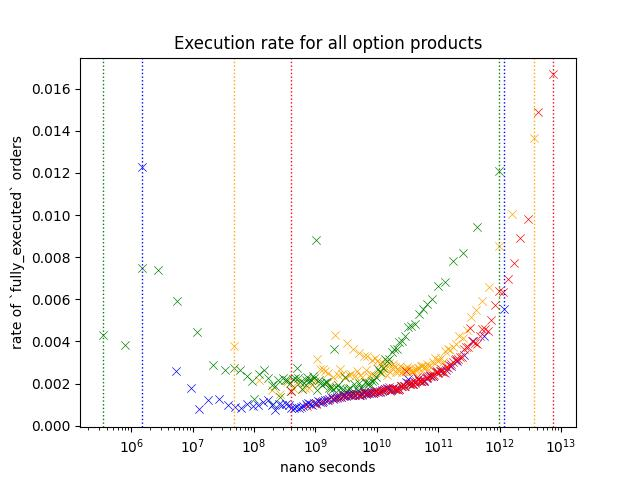
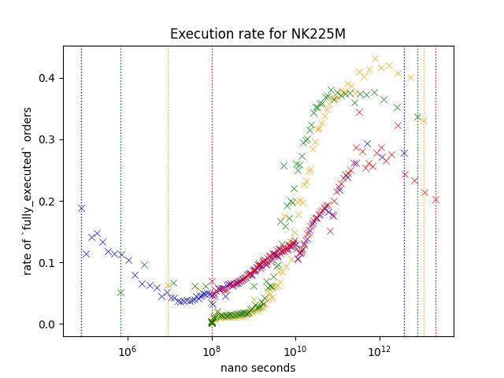

# Research Question 1: Speed and Execution Rate
- [Research Question 1: Speed and Execution Rate](#research-question-1-speed-and-execution-rate)
  - [Dataset](#dataset)
  - [Overview](#overview)
    - [Result1: Nikkei 225 and Nikkei 225 Mini Futures](#result1-nikkei-225-and-nikkei-225-mini-futures)
    - [Result2: Future Only](#result2-future-only)
    - [Result 3: Options Only](#result-3-options-only)
    - [Result 5: Comparison of products at nearest expiry; JGBL/NK225 Mini/NK225/TOPIX/TOPIX Mini](#result-5-comparison-of-products-at-nearest-expiry-jgblnk225-minink225topixtopix-mini)
  - [Future Direction](#future-direction)

It is said that orders from HFTs are more likely to be deleted, instead of getting matched with another order. 

Do faster orders get deleted more often?

## Dataset

This chapter only uses the data from March 1st.
You can find my dataset on kaggle.  

Link: [dataset](https://www.kaggle.com/datasets/a53e93e57a1/maker-order-dataset-osaka-20210301)

There is a notebook on kaggle which does something simliar to what I did on this chapter.

Link: [notebook](https://www.kaggle.com/datasets/a53e93e57a1/maker-order-dataset-osaka-20210301)

## Overview
Take a look at a scatter plot below.

Each scatter plot points represents a probability of an order within a specific range to be fully matched before it is removed or the business day has ended.

To visualize how the likeliness of an order changes under different cirumstances, I have plotted out different variables/subset in different color.

*I'm going to call the probability of order to be `fully_executed` as `Execution Rate`*

Each data point represents,

\\[ P(X,A) = n(A_n)/n(S(X)) \\]

Where,  
- \\(S(X)_n\\) = Observations whose's value is in \\(\(n, n+1]\\) percentile.
- \\(A(X)_n\\) = Number of executed orders within \\(S(X)_n\\)
- \\(n(S_n)\\) = Number of observations in \\(S_n\\)
- \\(n(A_n)\\) = Number of observations in \\(A_n\\)
- \\(1 \leq n \lt 100\\)

I have considered some alterantives;
1. Cumulative Probability with line plot  
   I concluded that this would not be ideal when you want to figure out how it is like on different intervals.
2. Lineplot of KDE  
   There are few ways to pick the smoothing and this will greatly affect how the data will be presente; While, I thought that I could just put multiple plots with different smoothing values, it would be pretty messy 

Each color represents different variables;  

- Blue   
  Blue is based on how long order stayed on the order book.  
  It only includes orders that is deleted or fully matched.
  
  For example, if an order that is deleted or fully matched on 10:30 was inserted on 10:00, then the value for blue is 1.8e+12 nanoseconds or 30 minutes.

- Red  
  This is same as blue except that it include orders that was modified at least once.

- Yellow  

  Yellow is based on the longest time between order events.

  For example, if the order was inserted on 10:00, modified on 10:01, 10:05, then this value is 4 minutes (or 2.4e+11 nano seconds), because between 10:01 and 10:05 is longest wait time.
  
- Green  
  
  Yellow is based on the longest time between each order events.

  For example, if the order was inserted on 10:00, modified on 10:01, 10:05, then this value is 1 minutes (or 6e+10 nano seconds).

Yellow and Red can only be observed when the order is modified.
I added Green to see if it is the modification that is making the difference or not.

### Result1: Nikkei 225 and Nikkei 225 Mini Futures
Let's take a look at orders from NK225/NK225M.
Nikkei futures are the most actively traded rroducts on Osaka Exchange.

Execution rate is noticably higher for slower orders.
Yellow/Green shows higher execution rate but since Red is not as high as those two variables, I belive that this indicates that number of times it was modified is not the reason behind the higher execution rate.

### Result2: Future Only

Shape of the plot looks similar to Nikkei 225/Nikkei 225 Mini futures.  
I believe that the reason that execution rate is lower across different speed is because the data includes a lot of low-volume products that are dominated by market makers.

### Result 3: Options Only
This plot is same as the one shown on the start of this chapter.

Execution rate of options are lower compare to futures, and I believe this is because it includes a lot of inactive contracts like deep ITM/OTM options.
Most active contracts are the ones around ATM.  

Slower/faster orders shows a higher execution rate just like other orders, but execution rate of slower orders are lower compared to futures.

Additionally, we see a slight increase in execution rate for Yellow around 10^9 ~ 10^10 nano seconds.

This plots out the number of maker orders observed and the strike price of each optio:n contracts.
It shows that there are more maker orders around ATM and contracts that experienced execution during the business day is more likely to have more maker orders.

### Result 5: Comparison of products at nearest expiry; JGBL/NK225 Mini/NK225/TOPIX/TOPIX Mini

JGBL, NK225 Mini, NK225, TOPIX and TOPIX Mini is the most active products.
Following plot is based on the aggregate of orders appeared during March 2021.  

JGBL has a mini variant but I decided to exclude it since daily volume is very small.

Every product shows similar pattern;  
- Execution rate is higher when the order is slower. (Especially \(> 10^10\) )
- Execution rate of blue/red is lower than green/yellow for slower orders \(> 10^10\) while this is not true when the speed is between 10^8 and 10^10.

However, difference between blue/red and green/Yellow is different depending on the product.
For example, execution rate of orders around 10^12, red/blue is less than half of green/Yellow for NK225, but it is somewhere around the two third on JGBL.

I think this difference might be coming from those trading these products;

NK225 Mini can be traded through many retial brokers, along with affordable collateral requirements, it is known as the product very popular among retail traders.
NK225 requires higher collateral requirements, so I think You can assume that many orders are coming from those trading at a professional capasity.

TOPIX products are in the similar situation as well.

For JGBL, as most retail brokers does not offer this product I think it is reasonable to assume that majority of orders are coming from those trading at a professional capasity.

## Future Direction
I believe that this can be used for predicting volume, direction... etc.

I believe that order analysis gives an interesting insight into market.
Here are few things that I believe that I can do to get a better insight;

- Analyzing event-by-event
  
    We used an aggregate of order events (update, creation, deletion).   
    This approach simplfies the data; While this make things simpler, you are missing out lots of the information that could've been used.

-  Order flow prediction  
  
    We've seen different product showing different pattern.
    I think you could elavorate on this to identify order flow.

    For example, we know that Game Stop was very very popular among retails especially around the great short squeeze. But we cannot say the same for things like SOFR futures or Euro dollars futures; As far as I'm concerned, no one on wallstreet bets is talking about rate products.  
  
- Better plotting

  I used scatter plot believing that this is better than other methods that I could come up with.

  I'm pretty sure that there are better ways to do this, and I'd love to further explorer this domain.
  
  
