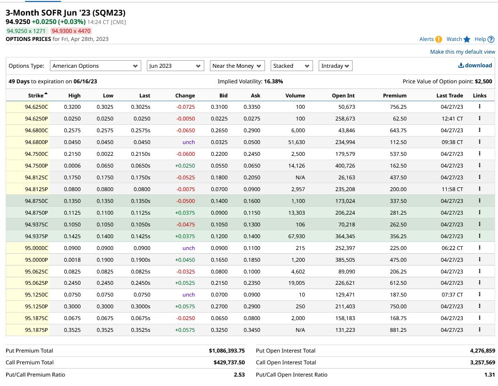

# Extra Research: long 30 days federal fund rate with covered call
The research question is unrelated to rest of the questions.  
This is more of a fun brain teaser than a research project.

So, the Russian commedians pranked J Powell.  
It turns out that he is planning for 2 rate hikes which is what market is pricing in.

Let's see if you can make money out of this.

## Three month SOFR rate
Three-Month SOFR is a future contract that tracks the interest rate.
Details can be found on [CME's website.](https://www.cmegroup.com/markets/interest-rates/stirs/eurodollar.contractSpecs.html)

While SOFR is not the fed rate itself, it collarates with it.
Importantly, unlike 30 days fed fund rate future, it has an active options market.

According to the website, the price quotation is,
```
contract-grade IMM Index = 100 minus R 

R = business-day compounded Secured Overnight Financing Rate (SOFR) per annum during contract Reference Quarter

Reference Quarter:  For a given contract, interval from (and including) 3rd Wed of 3rd month preceding delivery month, to (and not including) 3rd Wed of delivery month.
```

Formula for measuring theoretical price for future contract is;
(\(TheoreticalPrice = [100 - P] - [r (x/360)])\)
Where 
(\(P = R on the final settlement day\))

## Meeting Probabilities
According to FedWatch tool on CME, probability of fed hikinng on 6/14/2023 meeting is just over 90%. No change is at 10%. 

Meeting probability is;

| Rate Range  | 475-500 | 500-525 | 525-550 |
| ----------- | ------- | ------- | ------- |
| Probability | 9.5%    | 68.7%   | 21.8%   |

Current price of Jun 2023 contract is 94.915; So, you are not going to lose money as long as the rate sticks at 5.085% or lower.

## Covered Puts/Calls
Assuming that rate will fall between 475 and 550, we can make a guranteed profit if we could build a position that doesn't lose moeny as long as it ends between them.

https://www.barchart.com/futures/quotes/SQM23/options/jun-23

Let's take a look at the options market.  
Here is the screen shot of the website.


So, 
- long future and covered call, you can get the break even of 94.9250 - 0.105 = 94.82.
- short future and covered puts, you can get the break even of 94.9250 + 0.12 = 95.045.

So, you can create a position where you'd only lose money the final settlement price becomes,  
| covered call     | covered put         |
| ---------------- | ------------------- |
| lower than 94.82 (5.25% or above) | greater than 95.045 (5% or lower)|

It *feels* like both positions are solid.
You can lose money when SOFR goes outside 5% ~ 5.25% range, but this is the most predicted range.

Unless the fed is trying to surprise the market, we should be able to turn a profit or at least not-lose money.

I think you can properly figure out if these positions are going to be profitable or not once you figure out the diviation between SOFR and fed target rate.

Also, you should've been able to have a better chance of success if you were able to trade this before the time decay took away the option's value.

## Future Direction

I think, with enough time, you can create a sophisticated model that allows you to make money off arbitrage trading.
Things that I need to figure out is,
- SOFR vs Fed Traget: How much do SOFR deviate from Fed Target?
- What are the tail risks of trading SOFR?

Since there are many products like Euro Dollars and T bills which collarates with rates, I think this is an interesting field to look into.


