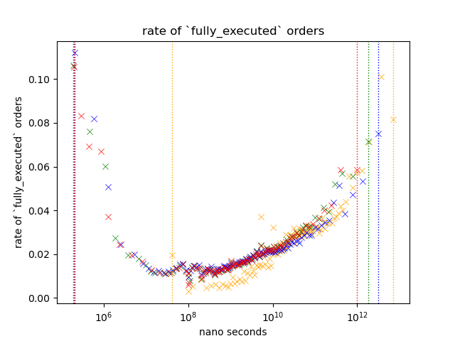
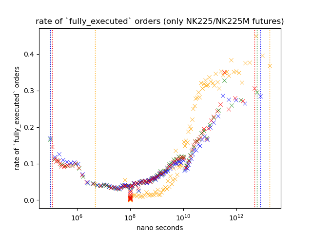
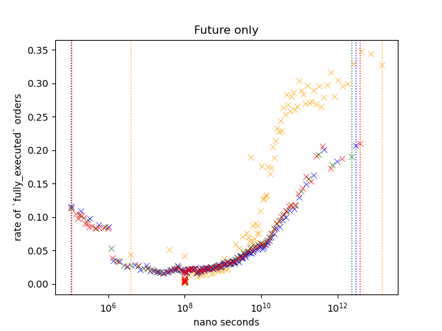
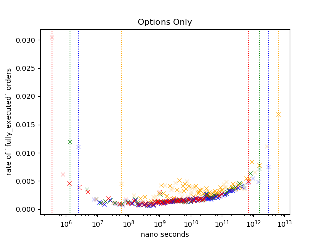
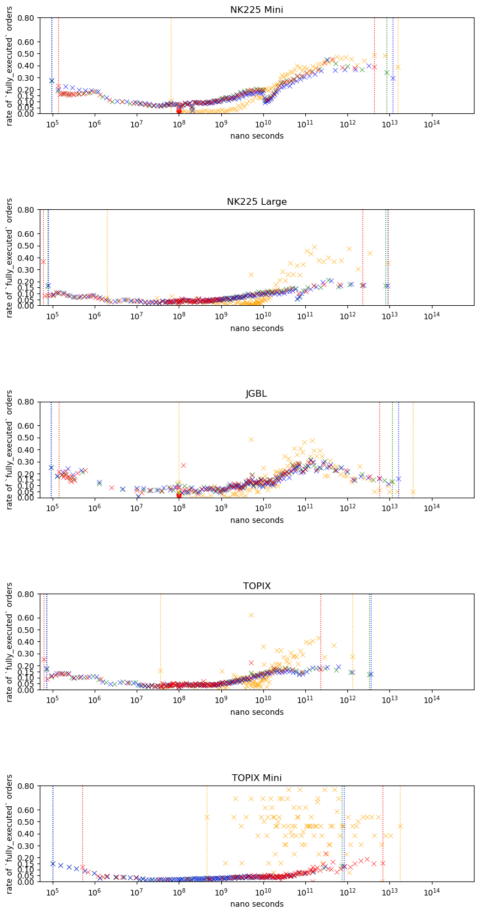

# 2. Research Question 1: Speed and Execution Rate
It is said that orders from HFTs are more likely to be deleted, instead of getting matched with another order. 

Do faster orders get deleted more often?

# Dataset

This chapter only uses the data from March 1st.
You can find my dataset on kaggle.  

Link: [dataset](https://www.kaggle.com/datasets/a53e93e57a1/maker-order-dataset-osaka-20210301)

There is a notebook on kaggle which does something simliar to what I did on this chapter.

Link: [notebook](https://www.kaggle.com/datasets/a53e93e57a1/maker-order-dataset-osaka-20210301)

# Methodology
Take a look at a scatter plot below.

Each scatter plot points represents a probability of an order within a specific range to have the variable `fully_executed` to be true.

To visualize how the likeliness of an order changes under different cirumstances, I have plotted out different variables/subset in different color.

*I'm going to call the probability of order to be `fully_executed` as `Execution Rate`*

Each data point is;

\\[ P(X,A) = n(A_n)/n(S(X)_n) \\]

Where,  
- \\(S(X)_n\\)= Every order whose value of variable \\(X\\)is between n and n+1 percentile of \\(X\\)
- \\(A_n\\)= Number of executed orders within \\(S_n\\)
- \\(n(S_n)\\)= Number of observations in \\(S_n\\)
- \\(n(A_n)\\)= Number of observations in \\(A_n\\)
- \\(1 \leq n \lt 100\\)

I have considered some alterantives;
1. Cumulative Probability with line plot  
   I concluded that this would not be ideal when you want to figure out how it is like on different intervals.
2. Lineplot of KDE  
   There are few ways to pick the smoothing and this will greatly affect how the data will be presente; While, I thought that I could just put multiple plots with different smoothing values, it would be pretty messy 

Each color represents different variables;  

- Blue  
  Blue is tells the duration of order's life.
  It is measured by measuring how long it has past since the order was inserted to the order book.

  For example, if the order was inserted on 10:00, then the value for blue is 1.8e+12 nanoseconds on 10:30.

- Green  
  
  This is same as blue *except* that it only shows the order that was modified at least once.
  
- Orange  

  Traders can modify the order, and the time between the each event indicates the trader's capability.

  Orange is based on the longest time between each events.

  For example, if the order was inserted on 10:00, modified on 10:01, 10:05, then deleted on 10:07, then this value would be 4 minutes (or 2.4e+11 nano seconds), because between 10:01 and 10:05 is longest wait time.
  
- Red  
  Red is based on the shortest time between each events.

  For example, if the order was inserted on 10:00, modified on 10:01, 10:05, then deleted on 10:07, then this value would be 1 minutes (or 6e+10 nano seconds), because between 10:00 and 10:01 is the shortest.

Orange and Red can only be observed when the order is modified.
I added Green to see if it is the modification that is making the difference or not.

## Result1: Nikkei 225 and Nikkei 225 Mini Futures
Let's take a look at orders from NK225/NK225M.
Nikkei futures are the most actively traded rroducts on Osaka Exchange.

Execution rate is noticably higher and while you can see higher execution rate on the slower end of the distribution, execution rate is somewhat higher on faster end.

Additionally, excution rate of the orange (`time_passed_since_last_event_max`) is more dynamic; Since we can't see the same on the red, I think we can attribute this to variable, and not `modify_count`.

## Result2: Future Only

Result is similar to that of the NK225/NK225M.  

Around 17% of orders are from NK225/NK225M; I think it is possible that it was not able to capture the features that other instrument has got.

## Result 3: Options Only
While execution rate of options are lower compare to futures in most group, somehow the fastest pint of Red shows the highest execution rate.

Slower/faster orders shows a higher execution rate just like other orders, but execution rate of slower orders are lower compared to futures.

Additionally, we see a slight increase in execution rate for orange around 10^9 ~ 10^10 nano seconds.

## Result 5: Comparing instrument at nearest expiry; JGBL/NK225 Mini/NK225/TOPIX/TOPIX Mini

I picked futures of JGBL/NK225 Mini/NK225/TOPIX/TOPIX Mini traded at nearest expiry date.

JGBL has a mini variant but I decided to exclude it since the volume is very small.

Ornage for TOPIX Mini is scattered across the plot though we can't see that on Red; So the difference should be coming from the difference in measurement, and not from the fact that orders are modified at least once.   

Execution rate for JGBL is higher for all colors; Interestingly the execution rate is the higest around 10^11.

## Discussion
We have seen that how difference in speed, products result in different execution rate.  
While, the method we used here is trivial, I think this is worth looking into.

### High Execution Rate For Orange: Is it what Flash Boys were talking about?
I read on Flash Boys that HFTs submit order just to keep it in the order book so that they can get the priority when they actually want to have it executed.

I think this can be the reason that the orange is showing high execution rate in some cases.

### differecent execution rate among different instruments
We observed different execution rate among different instrument.
Trend of execution rate for TOPIX mini was noticably different from others. 

I believe that  part of the reason that they exhibit different trend is because of the difference in the people who are trading them.

It is known that TOPIX Mini is popular among retail traders while JGBL is very difficult to trade if you are retail, since popular retail brokers like Rakuten or SBI doesn't offer them.

It should be interesting because this would help us identify the order flow; It could be coming from retail, institutionals, or someone else.

### Future Direction

I believe that this can be useful at predicting the market direction and predicting the future volume, as well as analyzing the activities of market participant such as retail volume ... etc.

I believe that order analysis gives an interesting insight into market.
Here are few things that I believe that I can do to get a better insight;

- Processing
  
    We used an aggregate of order events (update, creation, deletion). While this approach simplfies the analysis, you are missing a lot of pieces of information.  

    I would formulate the data into 
    

-  Order flow prediction
  
    As I discussed on [execution rate differecence between instrument](#execution-rate-differecence-between-instrument), I believe that by analyzing individual orders, we will be able to gain an insight into the order-flow.

    For example, we know that Game Stop was very very popular among retails especially around the great short squeeze. But we cannot say the same for things like SOFR futures or Euro dollars futures; As far as I'm concerned, no one on wallstreet bets is talking about rate products.

    We can use these products as a sample, fi 

    We've already seen different product exhibits different trend in execution rate, so I think this is a good way to move forward.
  
- Better plotting

  I used scatter plot believing that this is better than other methods that I could come up with.

  I'm pretty sure that there are better ways to do this, and I'd love to further explorer this domain.
  
  
