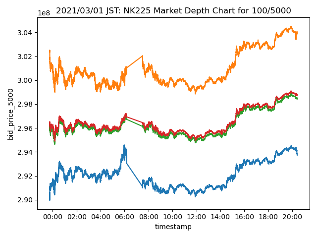

# Depth Imbalance
## Market Depth
Image below is the visualization of generated data.

Best bid/ask helps you keep track of the 

Effective Best Bid/Ask Price is measured as the average price of contracts you buy/sell when you place a market order of size \\(Q\\)

For example, say you want to know the EBBA Price of 10 Nikkei 225 Future contracts,
- For bid orders, there are 5 at 29,000 and 10 at 28,000
- For ask orders, there are 5 at 30,000 and 10 at 31,000
- Then, the EBBA Price is: 
- \\(Effective Bid = (5 * 29,000 + 5 * 28,000) \div 10 = 28,500\\)
- \\(Effective Ask = (5 * 30,000 + 5 * 31,000) \div 10 = 30,500\\)
- \\(Effective Spread = Effective Ask - Effective Bid = 20,000\\)

While Q can be any positive integer, I honestly don't think that \\(Q = 1001\\) and \\(Q = 1000\\) would make a whole lot of difference. 

I decided to prepare dataset with the following variations:

\\[Q = {1, 100, 500, 1000, 2000, 5000}\\]

\\(Q = 1\\) just means Best Bid/Ask.

## Update Frequency

This data is updated every time there is an update to the order book.
Order book is considered *updated*, when an order is added to the order book or if one of the order on the order book is removed, modified or matched.

## Source Code
Source code for generating this data can be found here.

- Q = 1
- Q = 100
- Q = 500
- Q = 1000
- Q = 2000
- Q = 5000

Depth imbalance aims to reveal the difference between the *effective bid/ask price*.

This image is a visualization of *depth imbalance*.

The orange chart is the difference between the ask price, and blue is the difference between the bid price.

I have 5 variations for market depth, each with \\(Q = \{ 100, 500, 1000, 2000, 5000 \} \\)
So, I decided to calculate with every combination.

# Update Frequency
Update frequency is same as the market depth.
This data is updated every time there is an update to the order book.
Order book is considered *updated*, when an order is added to the order book or if one of the order on the order book is removed, modified or matched.

# Example Data

# Calculations

Every \\( Q_1 \\) and \\( Q_2 \\) is \\( Q_1 < Q_2 \\).

- Ask Price Imbalance 
  
    *Effective Ask Price of* \\( MarketDpeth(Q_1) - MarketDpeth(Q_2) \\)

- Bid Price Imbalance 
  
    *Effective Bid Price of* \\( MarketDpeth(Q_1) - MarketDpeth(Q_2) \\)

- Spread Imbalance 

    *Effective BBO Spread of* \\( MarketDpeth(Q_1) - MarketDpeth(Q_2) \\)

# Source Code
Source code for generating this data can be found here.
