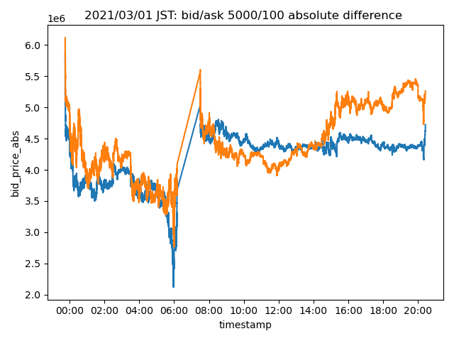

# Depth Imbalance

Depth imbalance aims to reveal the difference between the *effective bid/ask price*.

This image is a visualization of *depth imbalance*.

Above chart is generated using \\((Q=5000\\)) and \\((Q=100\\)) of market depth data.  
The orange chart is the difference between the ask price, and blue is the difference between the bid price.

I have 5 variations for market depth, each with \\(Q = \{ 100, 500, 1000, 2000, 5000 \} \\)
So, I decided to calculate with every combination.

# Update Frequency
Update frequency is same as the market depth.
This data is updated every time there is an update to the order book.
Order book is considered *updated*, when an order is added to the order book or if one of the order on the order book is removed, modified or matched.

# Example Data

# Calculations

Every \\( Q_1 \\) and \\( Q_2 \\) is \\( Q_1 < Q_2 \\).

- Ask Price Imbalance 
  
    *Effective Ask Price of* \\( MarketDpeth(Q_1) - MarketDpeth(Q_2) \\)

- Bid Price Imbalance 
  
    *Effective Bid Price of* \\( MarketDpeth(Q_1) - MarketDpeth(Q_2) \\)

- Spread Imbalance 

    *Effective BBO Spread of* \\( MarketDpeth(Q_1) - MarketDpeth(Q_2) \\)

# Source Code
Source code for generating this data can be found here.
