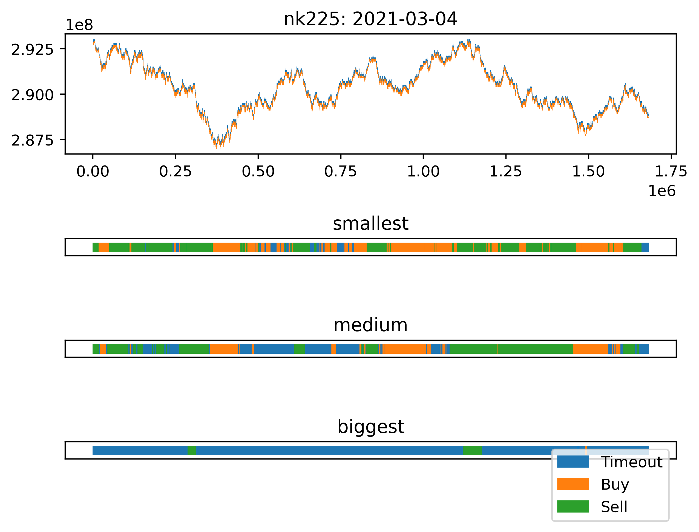

# Labels

Take a look at a following image:

The image on above is a line plot of bid/ask price of Nikkei 225 futures on March 4th, 2021.

The horizontal color bar shows the `label` assigned to a particular data point.

- Buy: Orange  
  If ask price hits \\(Ask Price + v > Bid Price\\) before \\(Bid Price - v > Ask Price\\) in 1 hour (3,600 seconds) then the label `Buy` is assigned. 

- Sell: Green  
  If ask price hits \\(Bid Price - v > Ask Price\\) before \\(Ask Price + v > Bid Price\\) in 1 hour (3,600 seconds) then the label `Sell` is assigned. 

- Timeout: Blue  
  Otherwise `Timeout` is assigned.

- Smallest/Medium/Biggest  
  This is the value of \\(v\\).

I generated labels for NK225, TOPIX and JGBL. Value for \\(v\\) is; 

- NK225  
  \\(v = \{ 50, 100, 250 \} \\) JPY

- TOPIX  
  \\(v = \{2.5, 5, 15\}\\) Points

- JGBL  
  \\(v = \{0.05, 0.1, 0.25\}\\) JPY

For example, in the case of the image above, the label assigned for the first data point is `Sell` since the condition for the Sell (50/100 JPY price move happens within 3600 seconds) but it's `Timeout` for `biggest` as the market didn't show 250 JPY price move.

## Update Frequency

This data is updated every time there is an update to the order book.
Order book is considered *updated*, when an order is added to the order book or if one of the order on the order book is removed, modified or matched.

# Considerations
- Percentage instead of absolute difference
The label is generated based on absolute difference.

I think you should use a relative value, such as percentage to ensure that the value for `v` is not going to  when you are looking at a data that lasts for years or highly volatile market like the one we saw it on Russia when Vladimir Putin turned Moscow market into r/wallstreetbets portofolio.

Since our dataset does not include significant price change, I think measuring it against absolute difference would be ok.

It was easier to implement and I didn't have to think about what price to use it as a base for calculating the percentage.

- NK225, TOPIX and JGBL

These three contracts are the products that are most actively traded on Osaka exchange.  

I learned that data you can find on contracts with smaller volume is very different; Stock Options on Osaka is very queit (nothing really happens, few contracts sees 1 or 2 taker in a day sometime). Same can be said for many combo products.  

It would be difficult to test the model with these quiet contracts, as you simply don't have the data.
So, I thought that I should just focus on the most active ones.

- Sizes of \\(v\\)

NK225, TOPIX and JGBL comes with different price, tick size and volatility; Thus, I had to give it a different value.  
These values are not based on some mathematical reasoning. I tried several different values and just stuck with the one that I felt comfortable with.

# Source Code

You can find the source code [here](https://github.com/thomas-k-cameron/jpx_mbo_features/src/bin/label_gen.rs).

# Note
I thought I was using \\(Q = 1\\) data, but I realized later that it was \\(Q = 10\\). 

Based on my inspection, it seems like that \\(Q = 10\\) is mostly the same as \\(Q = 1\\).

# Appendix
Below is the images for data visualized for each category.
