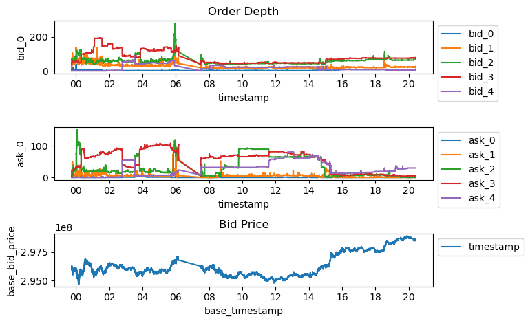

# Market Dpeth by Order Speed

I discovered that execution rate differs depending on I measured the speed of the order in different metrics.

We are going to plug that data to our model by aggregating the quantity of orders from best bid/ask.

Take a look at the image below.  

# Measuring the speed
## Rank

Each order is assigned with different rank based on the measured speed.

| n   | seconds       |
| --- | ------------- |
| 0   | <= 0.5        |
| 1   | 0.5 < n < 1   |
| 2   | 1 >= n > 10   |
| 3   | 10 >= n > 100 |
| 4   | 100 > n > 1000|

## Measuring the speed
Measurement is almost the same as the methodology I presented to you in question1.
- minimum reaction time
  
- maximum reaction time

- other rank  
Speed of order who is is inserted at that time point, cannot be measured and they are assigned to `other`.

# Measuring the speed

- First image shows the 

The plot on the buttom shows the bid/ask price, and the one on above 

# Update Frequency 
Update frequency is same as the market depth.
This data is updated every time there is an update to the order book.
Order book is considered *updated*, when an order is added to the order book or if one of the order on the order book is removed, modified or matched.
