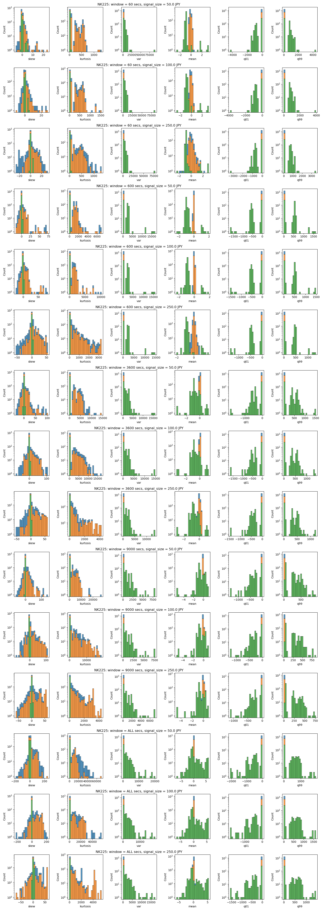

# Research Question 2: Taker Orders

## Summary

- I generated data to keep track of, taker order's 

## Overview of Variables
Below plot is the visualization of generated data.


- Reference Price  
  Reference price tracks the execution price of the future contract.

- Signal

  This is a categorical value that indicates the market move in next 3600 seconds
  It has 3 possible values:
  - Buy
    Indicates that Ask Price  in less than 3600 seconds
  - Sell
  - Timeout

- Profit at Maturity Measured Against Reference Price  
  This tracks taker's expected profit at maturity, it uses reference price as hypothetical final settlement price.

  Say, taker bought 5 call option at 300 whose strike price is 500.
  If the reference price is 600, then 
  - value of 0% moneyness is -200 * 5 = -1000. 
  - value of 3% moneyness is -20 * 5 = -100.
  - value of -3% moneyness is -300 * 5 = -1500.

  The plot shows the value at moneyness of 3% and -3%.

- Profit at Maturity Measured Against Reference Price *un-weigted* by volume

  Same the previous data except that value is dividedd by volume.
  Say, taker bought 5 call option at 300 whose strike price is 500.
  If the reference price is 600, then 
  - value of 0% moneyness is -200. 
  - value of 3% moneyness is -20.
  - value of -3% moneyness is -300.

- Aggregated volume
  
  This is the aggregated volume within a time window.
  
  If the window is 30 minutes and,
  1. 5 contracts executed on 10:10 and,
  2. 2 contracts executed on 10:20 then,
  value is 7.

- Number of executions
  
  This tracks the number of executions observed.

  If the window is 30 minutes and,
  1. 5 contracts executed on 10:10 and,
  2. 2 contracts executed on 10:20 then,
  value is 2.

- Unrealized Profit  

  This measures how much money the taker would make if they could sell it at the best bid/ask price.

  Say, 
  1. 4 contracts were bought by taker at 30,000 and
  2. 3 contracts were bought by taker at 29,500 and
  3. 2 contract was sold by taker at 29,000 and,
  4. 1 contract was sold by taker at 29,500 and,
  5. Current best bid/ask is 28,500/30,500
  Then, the value is -13000.
  
Here is a phesudo code for calculating them.
```
  (Sum (Best Ask Price - Taker's Buy Price) * Volume ) + (Sum (Best Bid Price - Taker's Sell Price) * Volume )
  = (((28,500 - 30,000) * 4) + ((28,500 - 29,500) * 3)) + (((29,000 - 30,500) * 2) + ((29,500 - 30,500) * 1))
  = -9000 + -4000
  = -13000
```
- Unrealized Profit (Un-Weigted by Volume) 

  Same as `Unrealized Profit` except that every executions are divided by it's volume.

  Say, 
  1. 4 contracts were bought by taker at 30,000 and
  2. 3 contracts were bought by taker at 29,500 and
  3. 2 contract was sold by taker at 29,000 and,
  4. 1 contract was sold by taker at 29,500 and,
  5. Current best bid/ask is 28,500/30,500
  Then, the value is

Here is a phesudo code for calculating them.
```
  (Sum (Best Ask Price - Taker's Buy Price)) + (Sum (Taker's Sell Price - Best Bid Price))
  = (((28500 - 30000) ) + ((28500 - 29500) )) + (((29000 - 30500) ) + ((29500 - 30500) ))
  = -2500 + -2500
  = -5000
```

- Parameters
  Generated data have 2 variables;
  - Window size 
    Size of the window. 
    The data I generated takes 60 seconds, 600 seconds, 3600 seconds, 9000 seconds, or entire business day.
  - Signal size 
    Signal is a categorical value which indicates which direction the market has moved.

Here is a psuedo code.
```
func Signal(Current Bid Price, Current Ask Price, Every Best Bid/Ask Price in Next 3600 seconds) {
    `Condition For Buy` = Best Ask Price >= (Current Bid Price + Q) 
    `Condition For Sell` = Best Bid Price >= (Current Bid Price + Q)
    
    if `Condition For Buy` is satisfied in next 3600 seconds before `Condition For Sell` is satisfied {
      return "Signal Is Sell"
    } else if `Condition For Sell` is satisfied in next 3600 seconds before `Condition For Buy` is satisfied {
      return "Signal Is Buy"
    } else if `Condition For Sell` and `Condition For Buy` is NOT satisfied {
      return "Signal is Timeout"
    }
}
```

## Statistical Summary
Here is a plot.



I inspected each variables by visualizing the statistical summary of each variables, grouped by it's corresponding signal.

You can find the example data (here)[!TODO]

I use skew, kurtosis, variance, mean, 1st percentile and 99th percentile of each variables .
For skew, kurtosis, variance and mean, I normalized the data by,

- converting each data point into percentile changes of it's previous data.

  e.g.

|      |     after | original data |
| ---: | --------: | ------------: |
|    0 |       nan |            10 |
|    1 |       0.1 |            11 |
|    2 | -0.181818 |             9 |

- removing outliers
  
  Any data point that does is not between 1% ~ 99% percentile is filtered.
  
- removing data points that did not change
  
  There were many data point which did not change from the previous value. Any data point that is `0` is removed.


- I couldn't develop a model that can make money off market movement.
- Upon inspecting the statistical summary, I discovered that there are many variables that `Timeout` does not overlap with `Buy` and/or `Sell` signal.