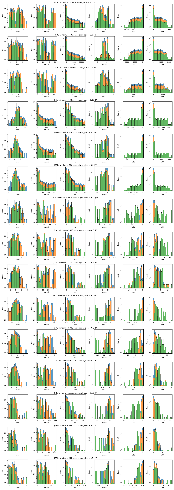
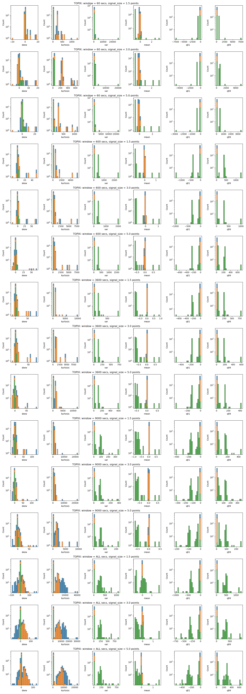

# Research Question 2: Taker Orders

## Summary

- I measured taker orders by it's unrealized profit, volume and profitability of their position at maturity  
- Products that I analyzed is Nikkei 225, TOPIX and Japanese Government Bond Future; For Nikkei 225 and TOPIX, mini variant is included.
- Statistical summary reveals that, underlying distribution of variable changes before large market move in many cases.

## Graphical Overview of Generated Data
Below plot is the visualization of generated data.

- Reference Price  
  Reference price tracks the execution price of the future contract.

- Signal

  This is a categorical value that takes one of 3 value;
  | Value   | Condition                                                                                                                    |
  | ------- | ---------------------------------------------------------------------------------------------------------------------------- |
  | Buy     | If you `buy` the contract at `ask price`, you can turn `X` point of profit by selling at `bid price` in next `3600 seconds`  |
  | Sell    | If you `sell` the contract at `bid price`, you can turn `X` point of profit by selling at `ask price` in next `3600 seconds` |
  | Timeout | None of the condition were met.                                                                                              |

- Profit at Maturity Measured Against Reference Price  
  This tracks taker's profit at maturity, it uses reference price as hypothetical final settlement price.

  Say, in last `T` seconds, we observed following transactions.
  | Product     | Taker's Side | Quantity | Strike Price | Transaction Price | Transaction Time |
  | ----------- | ------------ | -------- | ------------ | ----------------- | ---------------- |
  | Future      | Buy          | 10       | ---          | 19,900            | 10:00            |
  | Mini Future | Sell         | 10       | ---          | 20,100            | 11:00            |
  | Call option | Buy          | 10       | 20,000       | 500               | 10:30            |
  | Put option  | Sell         | 10       | 20,000       | 300               | 10:25            |

  When the reference price is 20,000JPY, value at maturity would be, 
  | Product     | -3% (19,400) | -2%(19,600) | -1%(19,800) | 0%(20,000) | 1%(20,200) | 2%(20,400) | 3%(20,600) |
  | ----------- | ------------ | ----------- | ----------- | ---------- | ---------- | ---------- | ---------- |
  | Future      | -5,000       | -3,000      | -1,000      | 1,000      | 3,000      | 5,000      | 7,000      |
  | Mini Future | 700          | 500         | 300         | 100        | -100       | -300       | -500       |
  | Call option | -5,000       | -5,000      | -5,000      | -5,000     | -3,000     | -1,000     | 1,000      |
  | Put option  | -3,000       | -1,000      | 1,000       | 3,000      | 3,000      | 3,000      | 3,000      |

- Profit at Maturity Measured Against Reference Price *un-weigted* by volume

  Say, in last `T` seconds, we observed following transactions (same as the previous example).
  | Product     | Taker's Side | Quantity | Strike Price | Transaction Price | Transaction Time |
  | ----------- | ------------ | -------- | ------------ | ----------------- | ---------------- |
  | Future      | Buy          | 10       | ---          | 19,900            | 10:00            |
  | Mini Future | Sell         | 10       | ---          | 20,100            | 11:00            |
  | Call option | Buy          | 10       | 20,000       | 500               | 10:30            |
  | Put option  | Sell         | 10       | 20,000       | 300               | 10:25            |

  When the reference price is 20,000JPY, value at maturity would be, 
  | Product     | -3% (19,400) | -2%(19,600) | -1%(19,800) | 0%(20,000) | 1%(20,200) | 2%(20,400) | 3%(20,600) |
  | ----------- | ------------ | ----------- | ----------- | ---------- | ---------- | ---------- | ---------- |
  | Future      | -500         | -300        | -100        | 100        | 300        | 500        | 700        |
  | Mini Future | 70           | 50          | 30          | 10         | -10        | -30        | -50        |
  | Call option | -500         | -500        | -500        | -500       | -300       | -100       | 100        |
  | Put option  | -300         | -100        | 100         | 300        | 300        | 300        | 300        |

- Aggregated volume
  
  This is the aggregated volume within a time window.

- Number of executions
  
  This tracks the number of executions observed.

- Unrealized Profit  

  Say, in last `T` seconds, we observed following transactions (same as the previous example).
  | Product     | Taker's Side | Quantity | Strike Price | Transaction Price | Transaction Time |
  | ----------- | ------------ | -------- | ------------ | ----------------- | ---------------- |
  | Future      | Buy          | 10       | ---          | 19,900            | 10:00            |
  | Mini Future | Sell         | 10       | ---          | 20,100            | 11:00            |
  | Call option | Buy          | 10       | 20,000       | 500               | 10:30            |
  | Put option  | Sell         | 10       | 20,000       | 300               | 10:25            |

  Unrealized gains at given best bid/ask is;
  | Product     | unrealized gains | best bid | best ask |
  | ----------- | ---------------- | -------- | -------- |
  | Future      | 11,000           | 21,000   | 21,100   |
  | Mini Future | 9,000            | 21,000   | 21,100   |
  | Call option | 10,000           | 1,500    | 1,700    |
  | Put option  | 10,000           | 100      | 200      |

- Unrealized Profit (Un-Weigted by Volume)  

  Say, in last `T` seconds, we observed following transactions (same as the previous example).
  | Product     | Taker's Side | Quantity | Strike Price | Transaction Price | Transaction Time |
  | ----------- | ------------ | -------- | ------------ | ----------------- | ---------------- |
  | Future      | Buy          | 10       | ---          | 19,900            | 10:00            |
  | Mini Future | Sell         | 10       | ---          | 20,100            | 11:00            |
  | Call option | Buy          | 10       | 20,000       | 500               | 10:30            |
  | Put option  | Sell         | 10       | 20,000       | 300               | 10:25            |

  Unrealized gains at given best bid/ask is;
  | Product     | unrealized gains | best bid | best ask |
  | ----------- | ---------------- | -------- | -------- |
  | Future      | 1,100            | 21,000   | 21,100   |
  | Mini Future | 900              | 21,000   | 21,100   |
  | Call option | 1,000            | 1,500    | 1,700    |
  | Put option  | 1,000            | 100      | 200      |

## Result
I calculated the summary statistics of each variables after grouping each data points by it's signal.

To sum up, I can say the following for each variable;

- Skew, Kurtosis  
  - For most variables, Skew of Timeout group is somewhere around 0, while skew of Buy/Sell group shows more variance.  
- Mean, Variance, 1st percentile and 99th percentile  
  - Buy/Sell group tends to be close to 0  
  - Some Timeout groups have larger/smaller value  
- Product Difference
  - JGBL
    - Overlap between Timeout group and others are more significant on JGBL, I'm suspecting that this is due to the smaller number of taker orders and volume 
  - TOPIX 
    - TOPIX's variable looks less scattered, this is coming from the lack of activity in it's options space.
    - Option related variables are removed.

Here is a plot that shows the aggregate of statistical summary of the data for each product.  
From left we have skew, kurtosis, variance, mean, 1% percentile and 99% percentile of the data.

The title tells you the parameter. For example, the first row says "NK225: window = 60 secs, signal_size = 50.0 JPY".
This means, the plot uses Nikkei 225 future data, with window size of 60 seconds, and signal size of 50 JPY.

## Dataset
Data used here can be found here.

Data is normalized by,

- converting each data point into percentile changes of it's previous data.

  e.g.

  |      |     after | original data |
  | ---: | --------: | ------------: |
  |    0 |       nan |            10 |
  |    1 |       0.1 |            11 |
  |    2 | -0.181818 |             9 |

- removing outliers
  
  Any data point that is not between 1% ~ 99% percentile is filtered.
  
- removing data points that did not change
  
  There were many data point which did not change from the previous value. Any data point that is `0` is removed.

## Visualization of Statistical Summary

### Nikkei Future
1
### JGBL Future

### TOPIX Future

